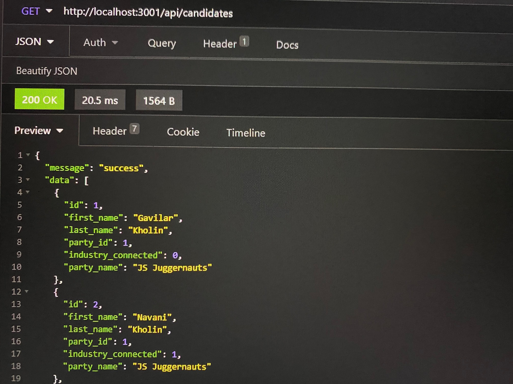

# u-develop-it

### Back End App

## Description

## Table of Contents

- [Installation](#installation)
- [Usage](#usage)
- [License](#license)
- [Author](#author)
- [Badges](#badges)

## Installation

To use this app you must clone the repository.

## Usage

Once cloned you'll need to navigate to it's root directory from your terminal. While in this app's root directory run node server.js.  
You'll also need [Insomnia](https://insomnia.rest/) to interact with this app.

## License

## Author

## Badges
